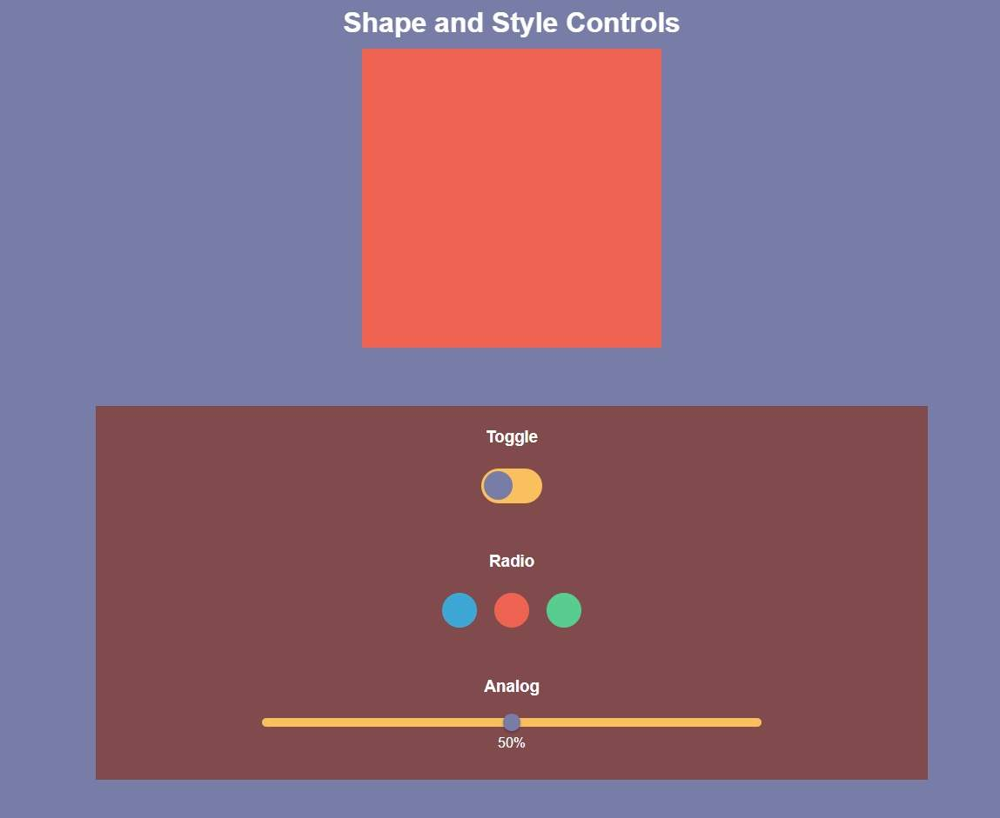

# Controls and Style: Control type tutorial
## Overview  
This tutorial guides you through creating a web application using HTML, CSS, and JavaScript. Although the UI is very simple, it establishes the fundamentals for developing much more complex controls. This also serves me as a sort of "toolbox" for future projects. 
### Control Features
- A shape toggle (circle/square) controlled by a switch.
- A color selector using radio buttons.
- A size slider to resize the shape dynamically.

### Skills Exercised
- Use utility functions in JavaScript.
- Use Roots and utility classes in CSS. 
- Handle multiple types of input. 
- Style common form elements with CSS.
- Add interactivity using event listeners.

### Prerequites 
- Basic knowledge of HTML, CSS, and JavaScript.
- A code editor (e.g., VSCode).
- A browser to test the project.  
### Walkthrough
1. HTML Structure
Start by creating a basic structure with the following sections:

- Target Shape: A div to apply styles dynamically.
- Toggle Control: A checkbox styled as a toggle switch.
- Radio Buttons: Colored options for selecting the shape's background color.
- Slider Control: A range input to adjust the shape's size.  
```html
<div class="target-shape"></div>
<div class="toggle-container">
  <input type="checkbox" id="toggle">
  <label for="toggle"></label>
</div>
```
2. CSS Styling
Define styles for:

- The shape: Set responsive width and height using clamp and aspect-ratio.
- The toggle switch: Style the checkbox with pseudo-elements.
- The radio buttons: Style the options as interactive colored circles.
- The slider: Customize the slider thumb and track.
```css
.target-shape {
  width: 18svw;
  aspect-ratio: 1 / 1;
  background-color: var(--clr-orange);
}
```
3. JavaScript Interactivity
Add event listeners to handle:

- Toggle: Switch between a square and a circle.
- Radio buttons: Change the shape's background color.
- Slider: Adjust the shape's size dynamically.
```js
function listen(event, element, callback) {
  return element.addEventListener(event, callback);
}
```
### Languages Used 




### Say Hi
If you have an comments or suggestions, please don't hesitate to reach out :)
[](https://linkedin.com/in/dave-sommerville-2abb50326)


[](mailto:dave.r.sommerville@gmail.com)

